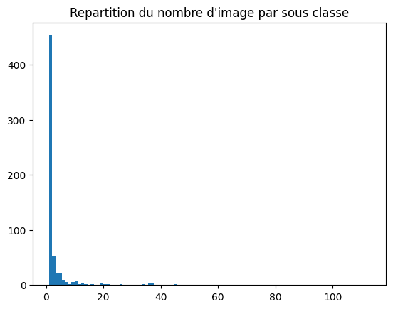

# Readme

Les classes sont discriminées par modèles tirés de l'ID des articles, sauf pour les accessoires qui
ont étés classés à la main.

Les sacs, SLG, chaussures et RTW sont assez précis et sont bien classés par forme (modèle).

On compte `625 classes`, réduits à `259` dans les vêtements.

## Répartition des sous classes:

```
W Accessories     18
W Bags            76
W RTW            366
W SLG            123
W Shoes           14
Watches           28

Total: 625
Total sans vêtements: 259
```

## Nombre d'images pour chaques sous classes:

